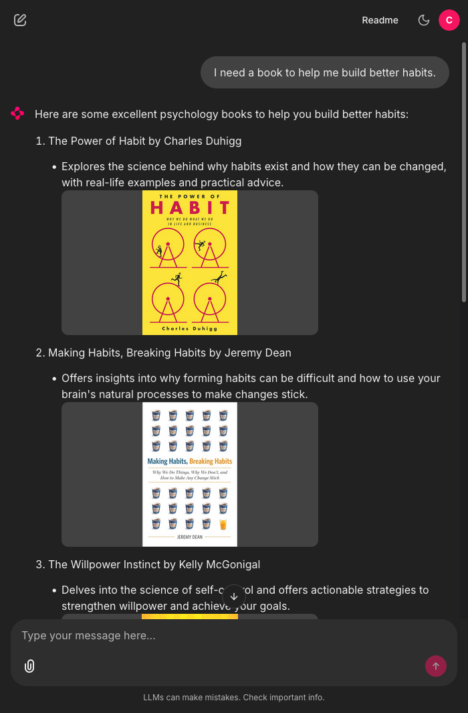

# Psychology Book Recommendation Chatbot

## Goal

This project is a RAG-based chatbot built for the Akbank GenAI Bootcamp. It recommends psychology books based on what you ask for. The bot successfully uses an intelligent agent that searches through ~3000 psychology books and gives you relevant suggestions.



## Dataset & Indexing

I used the [GoodReads 100k books](https://www.kaggle.com/datasets/mdhamani/goodreads-books-100k) dataset from Kaggle. The `build_index.py` script filters it down to only psychology books (around 3000 books) and builds a vector database using OpenAI embeddings. The indexed data lives in the `./db` folder in this repo, powered by `LanceDB`.

## Architecture

The bot uses `LangChain` for the agent logic, `Chainlit` for the web interface, and `LanceDB` as the vector store.

When you ask for a book, the agent decides whether to use its search tool. If it does, here's what happens:

### RAG Implementation

The RAG pipeline has three steps, each designed to improve the quality of recommendations:

1. **Query Expansion:** Your query gets rewritten by a small LLM to be more descriptive. **Why?** Simple queries like "coping with loss" become "books about grieving, processing loss, and finding emotional healing." This helps the vector search understand what you're really looking for.

2. **Broad Retrieval:** The system searches for 3x more books than you asked for. **Why?** Casting a wider net gives us more candidates to choose from, so we don't miss potentially perfect matches that vector search alone might overlook.

3. **LLM Reranking:** Another LLM looks at all the candidates and picks the best ones based on your _original_ query. **Why?** The LLM understands context and nuance better than pure vector similarity. It acts as a smart filter to make sure the final recommendations truly match what you meant.

The agent then gets this refined list and responds to you with the recommendations.

## How to Run

#### Locally

Create a virtual environment:

```sh
uv venv --python 3.13
```

Activate it:

```sh
source .venv/bin/activate
```

Install dependencies:

```sh
uv sync --locked
```

**To build the index yourself:**

1. Download `GoodReads_100k_books.csv` from Kaggle and put it in the root folder
2. Delete the `./db` folder
3. Run `python3 build_index.py`

**To run the chatbot:**

1. Set the `OPENAI_API_KEY` environment variable
2. Create a JWT secret with `chainlit create-secret` and set it as an environment variable
3. Run `chainlit run main.py`
4. Open `http://localhost:8000` and log in with username `cansu` and password `cansu`

#### Online

The bot is deployed at: [https://cansurag.up.railway.app/](https://cansurag.up.railway.app/)

Login with username `cansu` and password `cansu`.

## Possible Next Steps

- **Hybrid Search:** Right now the system only uses semantic search and LLM reranking. `LanceDB` supports keyword search, so adding that would create a hybrid approach that's more robust.

- **Chat History:** The RAG pipeline doesn't look at previous messages, so it might recommend the same book again if you ask similar questions. Telling the pipeline to exclude previously shown books would be good.
